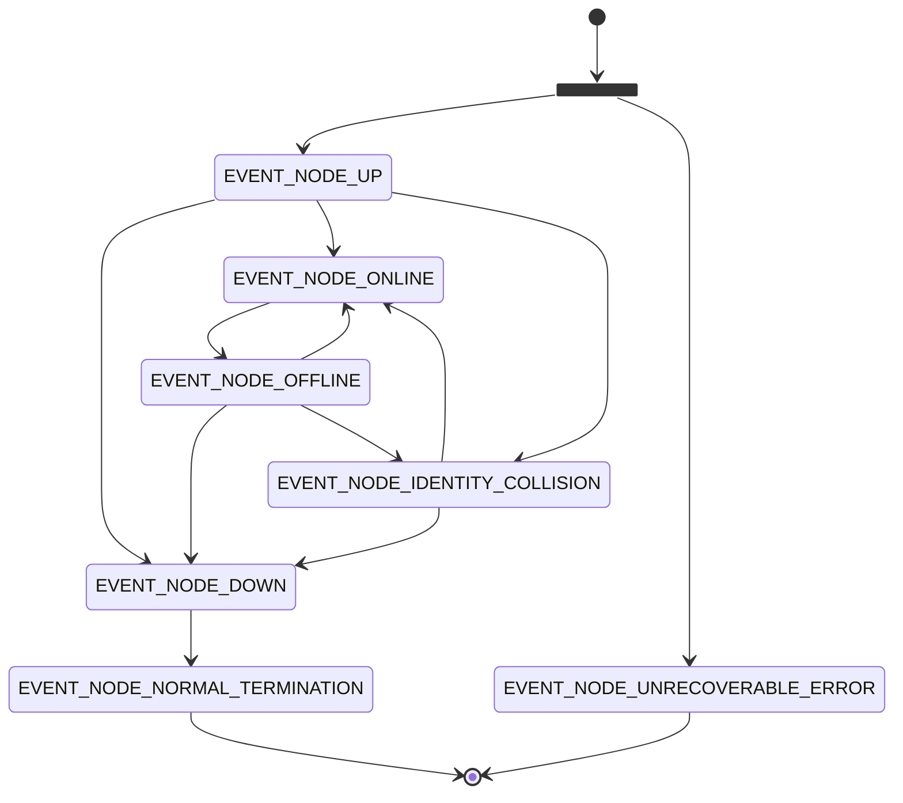

# Getting Started

This guide describes the necessary steps to create your first drasyl node and how to integrate it into your application.

Once the node is set up, it and therefore your application can participate in the drasyl Overlay Network and communicate with other nodes and applications.

## Add drasyl to your software

First, you have to add drasyl to your software. The easiest way to accomplish this is by using [Maven](https://maven.apache.org/).
To do this, add the Maven Repository from drasyl to your application's `pom.xml`:

```xml
<repositories>
    <repository>
        <id>gitlab-maven</id>
        <url>https://git.informatik.uni-hamburg.de/api/v4/groups/sane-public/-/packages/maven</url>
    </repository>
</repositories>
```

Now you can add drasyl as a dependency:

```xml
<dependency>
    <groupId>org.drasyl</groupId>
    <artifactId>drasyl-core</artifactId>
    <version>0.0.1-SNAPSHOT</version>
</dependency>
```

## Implementing `DrasylNode`

Next, you can create your own drasyl node by implementing [`DrasylNode`](../../drasyl-core/src/main/java/org/drasyl/DrasylNode.java).

This class contains the following methods that are now relevant for you:

* `send(...)`: allows your application to send arbitrary messages to other drasyl nodes.
* `onEvent(...)`: allows your application to react to certain events (e.g. process received messages). This method must be implemented.
* `start()`: starts the node, which will then automatically connect to the drasyl network.
* `shutdown()`: disconnects from the drasyl network and shuts down the node.
 
Here you can see a minimal working example of a node that forwards all received events to `System.out`:
```java
DrasylNode node = new DrasylNode() {
    @Override
    public void onEvent(Event event) {
        System.out.println("Event received: " + event);
    }
};
```

## Node Events

As mentioned before, different events are received by the application.
These provide information about the state of your node, received messages or connections to other nodes.
It is therefore important that you become familiar with the [definitions and implications](../../drasyl-core/src/main/java/org/drasyl/event/EventCode.java) of
the different event types.

For example, you should listen for `EVENT_NODE_ONLINE` before start sending messages, and pause when `EVENT_NODE_OFFLINE` has been received.

The state diagram below shows which events occur in which order during the lifetime of a drasyl node:



## Sending Messages

Every message that is to be sent requires a recipient address.
Each drasyl node creates an identity at its first startup consisting of a cryptographic public-private key pair.
From the public key, a 10 hex digit address is derived, by which each node can be uniquely identified.
Currently, addresses of recipient nodes must be known, as drasyl currently has no function for querying available addresses.

The `send()` method needs the recipient as first argument and the message payload as second argument (example `node.send("774caf2c50", "Hello World")`).

The method does not give any feedback on whether the message could be delivered. However, it can throw an exception if the local node has no connection to the
drasyl network.

## Receiving Messages

Each received message is announced as an `EVENT_MESSAGE` to the application. The event contains a pair with sender and payload of the message.

Example:
```java
...
public void onEvent(Event event) {
    if (event.getCode() == EVENT_MESSAGE) {
        Pair message = event.event.getMessage();
        System.out.println("Message received from " + message.first() + " with payload " + new String(message.second()));
    }
}
...
```

## Starting & Stopping the drasyl Node

Before you can use the drasyl node, you must start it using `node.start()`.
For communication with other nodes in the local network, the node starts a server
listening on port 22527. Make sure that the port is available.
After the node has been successfully started, it emits an `EVENT_NODE_UP` to the application.
Then, once it has successfully connected to the overlay network, an `EVENT_NODE_ONLINE` is emitted.

If the node is temporarily or permanently no longer needed, it can be shut down using `node.shutdown()`.
An `EVENT_NODE_DOWN` is emitted immediately after this call. The application should now no longer attempt to send messages.
As soon as the connection to the drasyl network is terminated, an `EVENT_NODE_OFFLINE` is emitted.
An `EVENT_NODE_NORMAL_TERMINATION` is created when the shutdown is done.

## Customize Configuration

drasyl is designed to work with zero-configuration. However, some use cases require configuration customization.

...TODO...