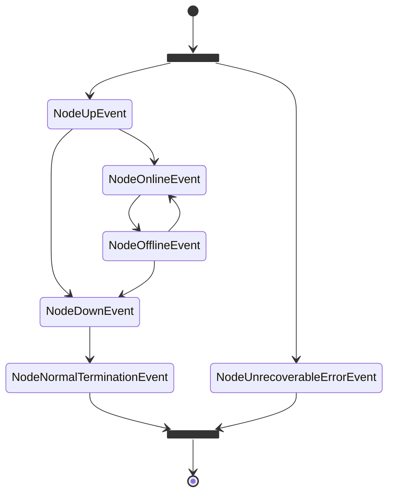

# Sequence Diagrams

## Node Events

The state diagram below shows which events occur in which order during the lifetime of a drasyl node:

```mermaid
stateDiagram-v2
    state started <<fork>>
        [*] --> started
        started --> NodeUpEvent
        NodeUpEvent --> NodeDownEvent
        NodeUpEvent --> NodeOnlineEvent
        NodeOnlineEvent --> NodeOfflineEvent
        NodeOfflineEvent --> NodeOnlineEvent
        NodeOfflineEvent --> NodeDownEvent
        NodeDownEvent --> NodeNormalTerminationEvent
        started --> NodeUnrecoverableErrorEvent

    state join <<join>>
        NodeNormalTerminationEvent --> join
        NodeUnrecoverableErrorEvent --> join
        join --> [*]
```
